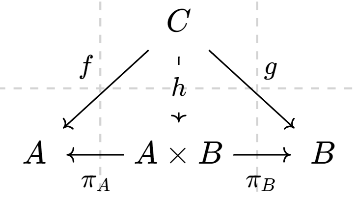

# 关于 Scala 中的单子与幺半范畴


本文的范畴论相关符号均以**李文威《代数学方法》两卷**为准，以个人记号为辅。


本文试图以 Scala 3 为蓝本给函数式编程里用到的单子与幺半范畴结构一个纯范畴论式的解释，我们把类型作为对象，纯函数 `A => B`  看作态射，以此构成一个范畴 $$\textsf{Scala}$$。

### 有限积与闭 Cartesian 范畴

我们先按照顺序定义构造出闭 Cartesian 范畴中的几个条件，其是从最基本的积推广而来的。

在范畴 $$\mathcal{C}$$ 中，对象 $$A, B\in\mathrm{Ob}(\mathcal{C})$$ 的**积**为三元组 $$(A\times B, \pi_{A}, \pi_{B})$$，其中：

* **积对象** $$A\times B\in\mathrm{Ob}(\mathcal{C})$$
* **投影态射** $$\pi_{A}\in \mathrm{Hom}_{\mathcal{C}}(A\times B, A)$$ 与 $$\pi_{B}: A\times B \to B$$ ，其满足：任取对象 $$C\in\mathrm{Ob}(\mathcal{C})$$ 与一对态射$$f\in\mathrm{Hom}_{\mathcal{C}}(C, A)$$ 与 $$g\in\mathrm{Hom}_{\mathcal{C}}(C, B)$$，存在态射 $$h\in\mathrm{Hom}_{\mathcal{C}}(C, A\times B)$$ 使得下图交换：

<figure><figcaption></figcaption></figure>

按照 [nLab](https://ncatlab.org/nlab/show/cartesian+closed+category) 上的说法，所谓的**有限积**就是有限个对象的积。在 $$\textsf{Scala}$$ 范畴中，积对象就是元组  `(A, B)` ，投影态射就是 `_1` 和 `_2` 方法（事实上这里标准的记号应该就是 $$\pi_{1}$$ 和 $$\pi_{2}$$ 但显然我更喜欢我自己的记法）。这个泛性质就相当于在定义一个新的纯函数：

```scala
def pi[C, A, B](f: C => A, g: C => B): C => (A, B) = c => (f(c), g(c))
```

然后对于任何的 `c: C` 必须有（毕竟在 Scala 中 `(a, b)._1 == a` 大概不需要证明）：

```scala
pi(f, g).andThen(_._1) == f
pi(f, g).andThen(_._2) == g
```

按图索骥的结果也是一致的。任何满足这两个式子的纯函数 `h: C ⇒ (A, B)` 必定是 `pi(f, g)`，因为我们显而易见地可以发现：若 `h(c)._1 == f(c)` 且 \`h(c).\_2 == g(c)\`，那这个 \`h(c)\` 只能是 `(f(c), g(c))`。

除了有限积以外，**闭 Cartesian 范畴**还要求拥有**终对象**（任取对象 $$B\in\mathrm{Ob}(\mathcal{C})$$ 其 Hom 集 $$\mathrm{Hom}_{\mathcal{C}}(B, A)$$ 只有1个元素，对应 Scala 里的 `Unit`，即 `A ⇒ Unit`），以及一个特殊的对象，我们称其为**指数对象**：任取对象 $$A, B\in\mathrm{Ob}(\mathcal{C})$$ 存在对象 $$B^{A}\in\mathrm{Ob}(\mathcal{C})$$ 与态射 $$e\in\mathrm{Hom}_{\mathcal{C}}(B^{A}\times A, B)$$ 使得任取 $$C\in\mathrm{Ob}(\mathcal{C})$$ 下图交换：

<figure><figcaption></figcaption></figure>

也就是说，这里相当于要求任取态射 $$f\in\mathrm{Hom}_{\mathcal{C}}(C\times A, B)$$ 存在唯一的态射 $$g\in\mathrm{Hom}_{\mathcal{C}}(C, B^{A})$$ 使得恒成立 $$f = e\circ (g\times \mathrm{id}_{A})$$。用 Scala 解释，指数对象 $$B^{A}$$ 就是 $$A ⇒ B$$，态射 $$e$$ 就是其的应用，即：

```scala
def eval[A, B]: ((A => B, A)) => B = { case (f, a) => f(a) }
```

这里的 $$f$$ 与 $$g$$ 对应 Curry 化和反 Curry 化，即：

```scala
def curry[A, B, C](f: ((C, A)) => B): C => (A => B) = c => a => f((c, a))

def uncurry[A, B, C](g: C => A => B): ((C, A)) => B = { case (c, a) => g(c)(a) }
```

也就是说，任取 `f: ((C, A)) ⇒ B` 存在唯一的 `curry(f)` 使得 `uncurry(curry(f)) == f`，反过来也一样，也就是说 Curry 化与反 Curry 化构成一一对应，这相当于闭 Cartesian 范畴里的**闭性**。

#### 有限积的伴随与切片范畴

在第一次接触时，我因为投影态射与终对象的缘故曾猜测闭 Cartesian 范畴与投射极限（逗号范畴 $$(\Delta /\beta$$) 的终对象，其中 $$\beta: \mathcal{D}^{\mathrm{op}}\to\mathcal{C}$$，对角函子 $$\Delta: \mathcal{C} \to\mathcal{C}^{\mathcal{D}}$$）有什么关系，但实际上这两个不一样。首先就是，对角函子是把一个对象复制成多个同样的对象，比如取 $$\Delta: A\mapsto A\times A$$ 的情况，此时积是它的右伴随；但是指数对象不一样，指数对象必须要固定一个 $$A$$ 的情况下的积，也就是 $$A\times-$$ 的右伴随，这个操作对应的就是我们刚才讨论过的 Curry 化。

大而泛地说，这里我们要从普通的关系提升到依赖的关系。首先我们来回顾一下逗号范畴的概念，给定两个函子 $$S: \mathcal{A}\to\mathcal{C}$$ 与 $$T: \mathcal{B}\to\mathcal{C}$$，**逗号范畴** $$(S/T)$$ 是包含如下信息的范畴：

* 对象：三元组 $$(A, B, f)$$，其中 $$A\in\mathrm{Ob}(\mathcal{A})$$，$$B\in\mathrm{Ob}(\mathcal{B})$$，$$f\in\mathrm{Hom}(SA, TB)$$。
* 态射：对象 $$(A, B, f)$$ 与 $$(A', B', f')$$ 之间的态射为二元组 $$(g, h)$$ 使得下图交换：

$$
\begin{CD}SA@>Sg>>SA'\\@VfVV@VVf'V\\TB@>>Th>TB'\end{CD}
$$

也就是说满足 $$Th\circ f = f'\circ Sg$$。考虑一个**终范畴**（只有 1 个对象，态射为这个对象的恒等态射的范畴）记作 $$\mathbf{1}$$，指定任意范畴 $$\mathcal{C}$$ 中的对象 $$A\in\mathrm{Ob}(\mathcal{C})$$ 相当于指定一个函子 $$j_{A}: \mathrm{1}\to\mathcal{C}$$，关于此的一个简单的例子是逗号范畴 $$(\mathrm{id}_{\mathcal{C}}/\mathrm{id}_{\mathcal{C}})$$，这个例子在《代数学方法》卷一中的泛性质部分也有所介绍，我们在此稍微详细介绍一下。按照定义，这相当于对象里的 $$f$$ 是 $$\mathrm{id}_{\mathcal{C}}A\to\mathrm{id}_{\mathcal{C}}B$$ 也就是 $$f: A\to B$$（任何态射与 $$\mathrm{id}_{\mathcal{C}}$$ 的合成关系显然），态射也就是两者之间的箭头：

$$
\begin{CD}A@>f>>B\\@VVV@VVV\\A'@>>f'>B'\end{CD}
$$

所以这个例子里的逗号范畴也叫**箭头范畴**。切片范畴是比箭头范畴相对复杂一些的情况，函子 $$T: \mathcal{D}\to\mathcal{C}$$ 与上述的 $$j_{A}: \mathbf{1}\to\mathcal{C}$$，我们把满足以下条件的逗号范畴 $$(T/j_{A})$$ 称为**切片范畴**并记作 $$(T/A)$$：

* 对象：任取 $$D\in\mathrm{Ob}(\mathcal{D})$$，二元组 $$(D, p: TD\to A)$$；
* 态射：态射 $$f\in\mathrm{Hom}_{\mathcal{D}}(D, D')$$ 使得下图交换：

<figure><figcaption></figcaption></figure>

此时 $$p\in\mathrm{Hom}_{\mathcal{D}}(TD, A)$$ 可以想象为一族被 $$A$$ 参数化的空间，任取 $$a\in A$$，$$p^{-1}(a)$$ 这种构造因为一些几何学缘故被称为 $$D$$ 在点 $$a$$ 的**纤维**，记作 $$D_{a}$$。一般来说，我们为了简便起见以下讨论的切片范畴都是上述的 $$T$$ 取 $$\mathrm{id}_{\mathcal{C}}$$ 的情况，也就是 $$(\mathrm{id}_{\mathcal{C}}/A)$$，此时其的对象 $$(D, p: D\to A)$$ 也被称为纤维，而且表达上更直接一些（所以我们可以称其为 $$A$$ 上长出来的纤维）。

从 Scala 的角度来看，对象 $$A$$ 的切片范畴相当于描述其的依赖类型的上下文，对象是 `p: X ⇒ A`，而态射是携带标签 `p(x): A` 的类型 `x: X`（也就是一个函数 $$h: X ⇒ Y$$ 满足 `q(h(x)) = p(x)`）。

我们接下来为了讨论方便把 Scala 语境下讨论的切片范畴记作 $$(S/A)$$，可以看到，两个对象的积其实相当于它们的拉回：

$$
\begin{CD}X\times_{A}Y@>>>Y\\@VVV@VVqV\\X@>>p>A\end{CD}
$$

假若我们转化到 $$\textsf{Set}$$ 范畴上讨论，可以看出 $$X\times_{A} Y = \{ (x, y) | p(x) = q(y) \}$$。所以这个切片范畴本身就是它自己的 Cartesian 范畴，因为终对象 $$\mathrm{id}_{A}$$ 存在，拉回作为积。

~~（TODO：局部 Cartesian 范畴，依赖积，依赖和的伴随关系，指数对象 = 沿投影的依赖积特例）~~

#### 关于 nLab 上的使用幺半范畴的定义的解释

这里额外说说当时学习时参考过的 [nLab](https://ncatlab.org/nlab/show/cartesian+closed+category) 上的定义，这里的定义结合上文比较好理解的就是这个内部 Hom，这点其实就是我们申明过的指数对象，但是这个 Cartesian 幺半结构比较诡异（也许因为 nLab 向来会概念套概念定义），对于不了解这部分的初学者来说很绕。

简单来说，如果选择我们刚才选取的积作为张量积 $$\otimes:\mathcal{V}\times\mathcal{V}\to\mathcal{V}$$，也就是 $$(A, B)\mapsto A\times B$$，我们已经讨论了它的泛性质，所以这里略过，幺元就是终对象，暂时略过合成约束之类的定义部分，这样就大致构成了1个幺半范畴，这个结构就是 **Cartesian 幺半范畴**（或许因为张量积是 Cartesian 积，而幺元就是终对象）。在 nLab 的定义中：

> A cartesian closed category is a category with finite products **which is closed with respect to its cartesian monoidal structure**.

这里闭 Cartesian 范畴的闭性实际上是因为选取了闭幺半范畴，也就是说函子 $$-\otimes A$$ 的右伴随（内部 Hom）$$-^{A}$$ 满足自然同构，按内部 Hom 的记法一般是记作 $$[A, -]$$ 这样，这里要求的条件就是：

$$
\mathrm{Hom}_{\mathcal{V}}(A\times B, C)\cong\mathrm{Hom}_{\mathcal{V}}(A, B^{C})
$$

所以整理一下就是，闭 Cartesian 范畴 $$\mathcal{C}$$ 是一个满足以下条件的范畴：

1. $$\mathcal{C}$$ 存在有限积
2. 任取对象 $$A\in\mathrm{Ob}(\mathcal{C})$$ 函子 $$A\times -: \mathcal{C}\to\mathcal{C}$$ 总有右伴随 $$-^{A}: \mathcal{C}\to\mathcal{C}$$。

第 2 条的等价描述就是我们上面的泛性质定义与这里讨论的闭 Cartesian 幺半范畴定义。

### 松幺半函子与 Scala Applicative

~~（TODO：完善描述）~~

### 自函子范畴中的幺半群对象与 Scala Monad

~~（TODO：完善描述）~~
